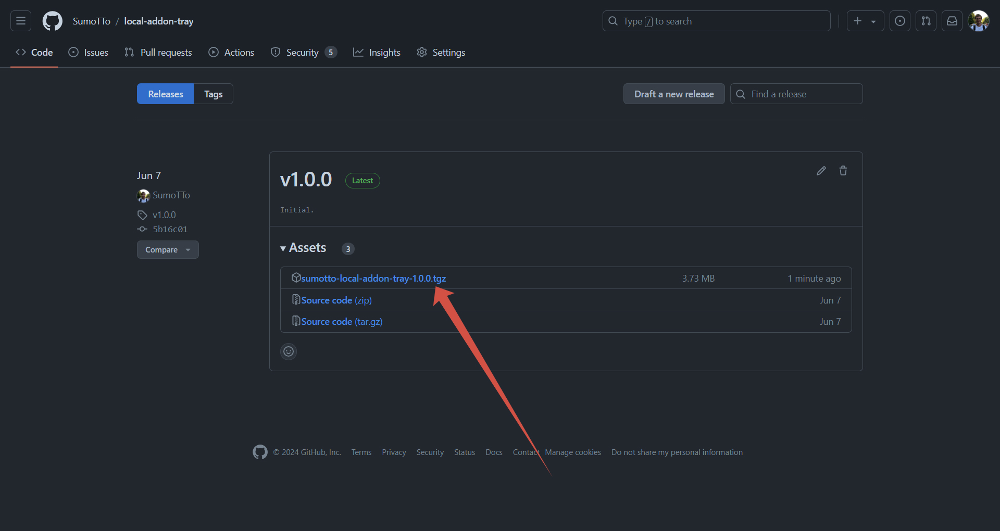
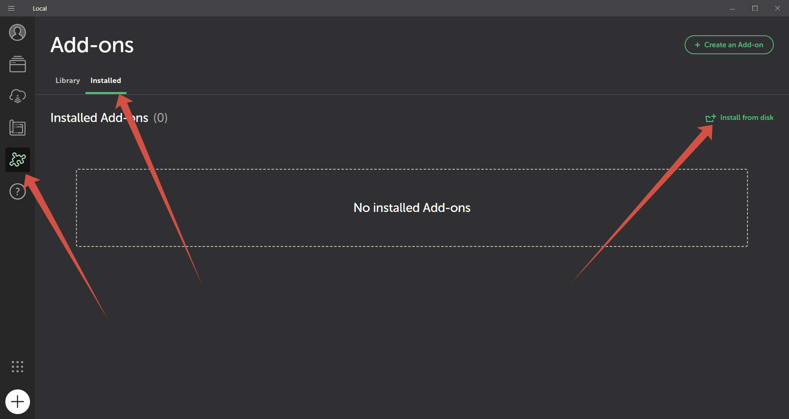
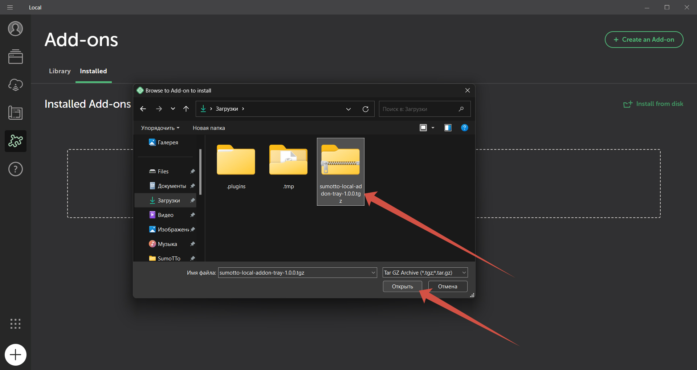
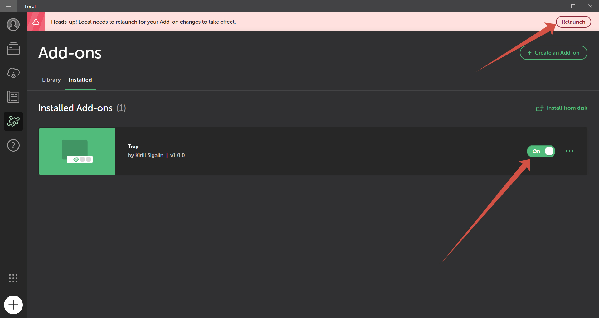

# Tray Addon for Local By Flywheel

Instead of closing, it minimizes Local to tray.

## Installation

1. Download @sumotto-local-addon-tray.tar.gz from [the latest release](https://github.com/SumoTTo/local-addon-tray/releases/latest/) 
   
2. Open Local by Flywheel and go to  Add-ons > Installed > Install from disk 
   
3. Select the archive you downloaded. 
   
4. Turn on the radio button and reboot. 
   

## License

MIT
